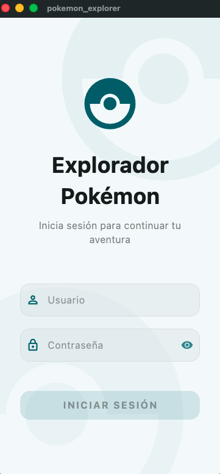
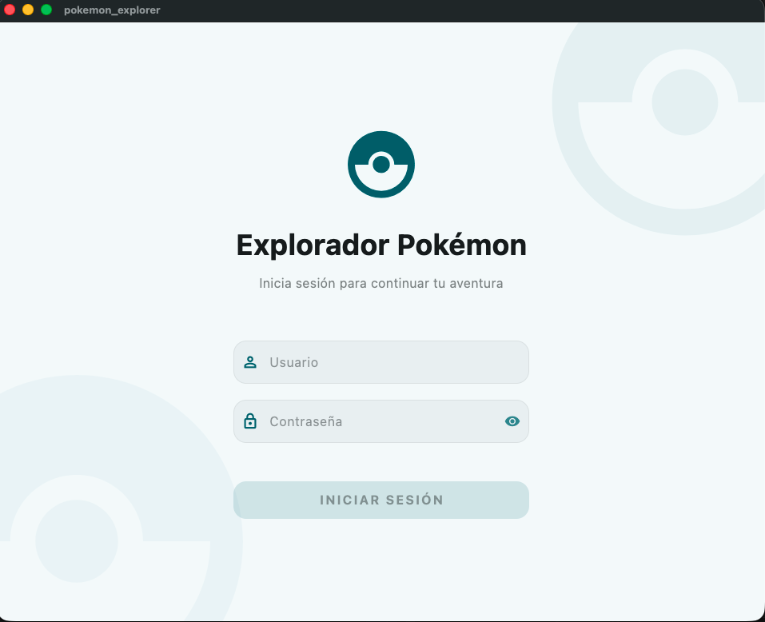

<h1 align="center">🚀 Pokémon Explorer</h1>

<p align="center">
  
  
  
</p>

<p align="center">
  
  
  
  
</p>

---

## Descripción

Pokémon Explorer es una aplicación móvil y de escritorio desarrollada con Flutter que permite a los usuarios explorar el catálogo de Pokémon consumiendo la [PokeAPI](https://pokeapi.co/). El proyecto ha sido diseñado bajo principios de **Clean Architecture** para garantizar la escalabilidad, la facilidad de testeo y el desacoplamiento de componentes.

## Tecnologías y Herramientas

- **Lenguaje**: Dart 3.10.8
- **Framework**: Flutter 3.38.9
- **Gestión de Estado**: GetX (Reactividad y Dependencias)
- **Persistencia**: GetStorage (Caché local)
- **Navegación**: GetX Routing con Middleware
- **Pruebas**: Mocktail (Unit Testing)
- **CI/CD**: GitHub Actions (Automated Testing & Analysis)

## Arquitectura del Proyecto

El código se organiza de manera modular siguiendo una estructura orientada a características (*Feature-driven*):

- **Core**: Contiene la infraestructura base, configuración de red, temas globales y utilidades compartidas.
- **Features**: Cada funcionalidad (Auth, Pokemon, Favorites, Settings) está encapsulada en su propio módulo, separando la lógica de datos de la presentación.
- **Services**: Servicios globales que gestionan el estado persistente de la aplicación (Autenticación, Favoritos, Preferencias).
- **Routes**: Definición centralizada de la navegación y protección de rutas.

## Características Técnicas

### Gestión de Datos
- **Caché Offline con Reconstrucción**: El repositorio prioriza datos locales y reconstruye la lista principal escaneando los objetos individuales en caché si la red o el índice fallan.
- **Persistencia de Objetos**: Separación de caché de listas y caché de detalles para garantizar la disponibilidad inmediata de los datos ya consultados.
- **Sincronización Centralizada**: Gestión de favoritos y configuraciones (columnas, tema, idioma) persistida localmente y sincronizada con el borrado de caché.

### Rendimiento y UX
- **Optimización de Carga**: Procesamiento por lotes en la obtención de detalles en segundo plano para evitar bloqueos en la interfaz y asegurar 60 FPS estables.
- **Detección de Red**: Monitoreo de conexión con banner no intrusivo, auto-reintento y estados de error con animaciones integradas.
- **Búsqueda Optimizada**: Sistema de búsqueda con debounce de 800ms y botón de limpieza instantánea vinculado al controlador.

### Estructura y Adaptabilidad
- **Layout Adaptativo**: Sistema que recalcula la cuadrícula y los componentes según el tamaño de pantalla (Móvil/Desktop) y la configuración del usuario.
- **Arquitectura Modular**: Estructura desacoplada por características, sin valores fijos en el código y lista para escalar.
- **Navegación Segura**: Rutas protegidas mediante middlewares y transferencia de argumentos con tipado estricto.

### Acceso y Navegación (Prueba Técnica)
- **Credenciales de Acceso**: Implementación del login obligatorio con validación local (Usuario: `flutter` / Contraseña: `flutter`).
- **Flujo de Navegación**: Splash Screen inicial, seguido de la pantalla de Login y acceso al Home solo tras autenticación exitosa.

### Personalización y Experiencia de Usuario
- **Soporte Multiidioma**: Sistema de internacionalización (i18n) que permite el cambio dinámico entre Inglés y Español.
- **Temas Dinámicos**: Soporte nativo para Modo Oscuro y Modo Claro con persistencia de preferencia.
- **Personalización de Interfaz**: Selección de colores de acento y configuración dinámica de columnas en la cuadrícula.
- **Perfil de Usuario**: Sección dedicada con selección de avatares Pokémon animados y persistencia de datos.

## Guía de Pruebas de Robustez (Modo Offline)
Para verificar la estabilidad y el manejo de datos locales de la aplicación, se sugieren los siguientes pasos:
1. **Carga Inicial**: Navegue por la lista y entre a varios Pokémon para generar caché.
2. **Modo Avión / Sin Red**: Desconecte el internet del dispositivo.
3. **Navegación Continua**: Regrese al Home o entre a los Pokémon ya visitados; la app cargará los datos instantáneamente desde el disco.
4. **Búsqueda Offline**: Use el buscador sin conexión; el sistema filtrará los resultados basándose únicamente en los datos cacheados.
5. **Reconstrucción de Lista**: Si la lista principal no está disponible, el repositorio reconstruirá la vista utilizando los objetos individuales guardados, evitando pantallas de error vacías.

## Capturas de Pantalla

| Vista Móvil | Vista Escritorio |
| :---: | :---: |
|  |  |

---

## Instalación y Ejecución

Para clonar y ejecutar esta aplicación localmente, sigue estos pasos:

1. **Clonar el repositorio**
   ```bash
   git clone https://github.com/derlishn/pokemon_explorer.git
   ```

2. **Instalar dependencias**
   ```bash
   flutter pub get
   ```

3. **Ejecutar la aplicación**
   - Para móvil/escritorio:
     ```bash
     flutter run
     ```
   - Para versiones específicas:
     ```bash
     flutter run -d chrome  # Web
     flutter run -d macos   # macOS
     ```

## Ejecución de Tests

Para validar la integridad del código, puedes ejecutar la suite de pruebas unitarias:

```bash
flutter test --reporter expanded
```

---
*Este proyecto es una demostración técnica de implementación de arquitectura limpia y manejo de estados en Flutter.*
